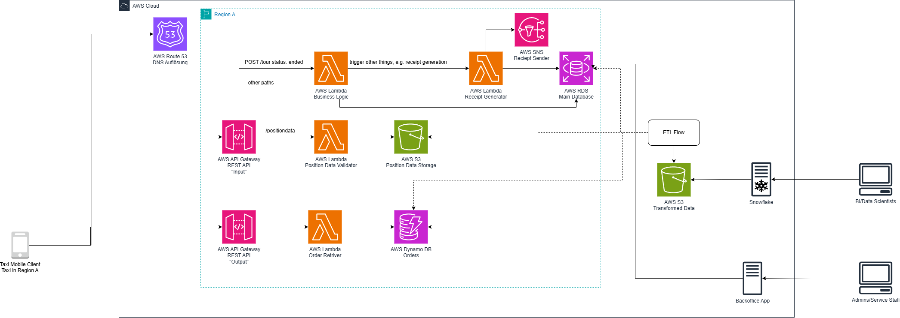

# Nils Marx - Aufgabe für Schwarz IT Cloud Platform Engineer - Aufgabe B

## Architektur

### Anforderungen

Um die Architektur für unser fiktives Taxiunternehmen gestalten zu können, müssen wir zunächst die Anforderungen erfassen, die die Aufgabe an uns stellt.

"Design an architecture that allows us to collect, process, and analyze data from our taxi operation as well as send data back to individual cars."

Wir müssen:
* Die Daten, die durch die Operation der einzelnen Taxis entstehen, annehmen können.
* Diese Daten dauerhaft verwahren.
* Diese Daten aufbereiten und analysieren können.
* An die einzelnen Taxis zurückmelden bzw. an die jeweiligen Taxis Daten senden können.
* Die Endpunkte global verfügbar machen.
* Die Endpunkte 24 Stunden am Tag, 365 Tage im Jahr verfügbar machen.

### Wahl von AWS

Diese Architektur entwerfe ich in AWS, da ich damit am meisten vertraut bin und eine Lösung bauen möchte, die möglichst cloud-native ist.

Allerdings ist diese Architektur vor allem als Gesprächsgrundlage und als Darstellung meiner Fähigkeiten gedacht.

Ich setze hier auf eine AWS-Architektur, um die globale Verfügbarkeit, die Stabilität, die Skalierbarkeit und auch die schnellere Bereitstellungszeit sowie vereinfachte Verwaltung nutzen zu können.

Je nach Priorisierung der einzelnen Ziele, die von dem Unternehmen verfolgt werden, wäre es also durchaus möglich, dass andere Lösungen sinnvoller sind.

Ist es beispielsweise von Interesse, eine möglichst große Unabhängigkeit von Cloud-Anbietern zu erreichen, um einen "Vendor-Lock-In" zu vermeiden, wäre es sinnvoll, auf eine Lösung zu setzen, die größtenteils die weitverbreiteten Container-Orchestrierungslösungen Kubernetes oder OpenShift nutzt. In so einem Fall müssten allerdings Funktionen der Cloud-Anbieter, wie z.B. Load Balancing und globale Datenbanken, selbst implementiert werden, was wiederum größere Entwicklungskosten zu Beginn mit sich bringt.

Das Betreiben der Infrastruktur hingegen wäre höchstwahrscheinlich auf lange Sicht günstiger, da hierbei auf andere Cloud-Provider gesetzt werden kann, die "nur" V-Server anbieten, aber dafür günstiger als die großen Provider sind (wie z.B. Hetzner).

Je nach Größe der Operation wäre es eventuell wirtschaftlich sinnvoll, ein eigenes Rechenzentrum zu betreiben; auch das würde leichter fallen, wenn die Architektur nicht cloud-provider-spezifisch wäre.

### Annahmen und Entscheidungen 

Um den obigen Anforderungen gerecht zu werden, möchte ich zuerst ein paar Entscheidungen bzw. Annahmen treffen, die für die Architektur relevant sind. 

#### 1. Annahme: Die Fahrer:innen (und eventuell auch die Kund:innen) der Taxis kommunizieren mit unserer Infrastruktur per App.
Auch wenn diese Tatsache in der Aufgabenstellung nicht direkt genannt wird, ist sie für mich die einleuchtendste. 

Es wäre auch denkbar, dass die Fahrzeuge selbst per IoT-Bauteile kommunizieren und das ohne Zutun der Fahrer:innen, oder dass das Ganze über ein Callcenter läuft, welches wiederum unsere Services per Weboberfläche anspricht.

Für unser Beispiel gehe ich aber zunächst von einer mobilen App aus.

#### 2. Entscheidung: Das Kommunizieren von Taxi zu Backend und von Backend zu Taxi.
Für die Operation ist es notwendig, sowohl Daten von den Taxis an unser Backend zu senden (z.B. aktuelle Positionsdaten oder Auftragsaktualisierungen), als auch Daten von unserem Backend an die Taxis zu senden (z.B. Push eines neuen Auftrags oder eine Nachricht an das Taxi).

Dafür bieten sich uns unterschiedliche Möglichkeiten:

##### 1. API und Polling
Um Daten an das Backend zu senden, sendet die mobile App HTTPS-Anfragen an eine API des Backends. Um Daten vom Backend zu erhalten, sendet die mobile App in regelmäßigen Abständen Anfragen an das Backend, um zu überprüfen, ob neue Daten verfügbar sind.

Vorteile:
* Einfach zu implementieren und zu verstehen.
* Keine speziellen Protokolle oder Infrastruktur erforderlich.
* Einfach zu warten und größtenteils zustandslos.

Nachteile:
* Hoher Ressourcenverbrauch, da ständig Anfragen gesendet werden, auch wenn keine neuen Daten vorliegen.
* Verzögerungen bei der Datenaktualität, abhängig von der Polling-Rate.
* Erhöhte Latenz, da der Client möglicherweise nicht sofort über neue Aufträge informiert wird.

##### 2. API und WebSockets
Eine Alternative zum Polling ist die Verwendung von WebSockets, die eine bidirektionale Kommunikation zwischen der mobilen App und dem Backend ermöglichen.

Vorteile:
* Echtzeitkommunikation, da Updates sofort an die App gesendet werden können.
* Geringerer Ressourcenverbrauch, da keine ständigen Anfragen gesendet werden müssen.

Nachteile:

* Komplexere Implementierung und Verwaltung der WebSocket-Verbindungen.
* Mögliche Probleme mit der Verbindungsstabilität, insbesondere in mobilen Umgebungen.

##### 3. MQTT (AWS IoT Core)

Eine weitere Möglichkeit zur Kommunikation zwischen der mobilen App und dem Backend ist die Verwendung von MQTT über AWS IoT Core.

Vorteile:

* MQTT ermöglicht eine sofortige Benachrichtigung der Taxis über neue Aufträge oder Statusänderungen, da es ein Publish/Subscribe-Modell verwendet.
* Das Protokoll ist für geringe Bandbreiten optimiert und ist somit datensparsamer.
* MQTT ist zustandslos, was die Verwaltung der Verbindungen vereinfacht.

Nachteile:

* Komplexität der Implementierung: Die Einrichtung eines MQTT-Brokers und die Verwaltung von Abonnements können komplexer sein als einfache HTTP-APIs, vor allem, da ich noch nie mit AWS IoT Core gearbeitet habe.
* Sicherheitsanforderungen, obwohl MQTT Sicherheitsfunktionen bietet, müssen zusätzliche Maßnahmen ergriffen werden, um die Kommunikation zu sichern.

##### Fazit

Aufgrund der geringsten Komplexität und der fehlenden Erfahrung mit MQTT habe ich mich in dieser Architektur für Option eins, API und Polling, entschieden.

### Architekturdiagramm

Das folgende Diagramm zeigt die Architektur für unser Taxiunternehmen, um Daten aufzunehmen, diese zu speichern, zu verarbeiten und zu analysieren.

Des Weiteren gibt es die Möglichkeit, den mobilen Clients in den Taxis Mitteilungen zukommen zu lassen.



Um dieses Diagramm zu verstehen betrachten wir folgende UseCases

#### Interaktion mobile Client mit unserem Backend

Zunächst betrachten wir die Pfade ausgehend vom mobile client links im Bild, bei allen dieser Pfade wird zuerst Route 53 die URL zum jeweiligen Service aufgelöst.

##### Das Taxi meldet seine Positionsdaten 

Der mobile Client meldet in einem bestimmten Intervall seine Geolokation über das API Gateway "Input" auf dem Pfad "/positiondata".

Diese Anfrage wird von der Lambda "Position Data Validator" auf Plausibilität und andere Dinge überprüft und, wenn es keine Probleme gibt, in den S3-Bucket "Position Data Storage" abgelegt.

Der S3-Bucket ermöglicht es uns regionsspezifisch halb-unstrukturiererte Daten abzulegen die wir später erst ordnen möchten. Zwar ist für unser Beispiel erstmal nur von Positionsdaten die rede, dennoch sind auch andere Daten denkbar die unstrukturierter sind.

##### Das Taxi empfängt Anweisungen

Periodisch überprüft der mobile Client, ob es neue Mitteilungen an ihn gibt. Dafür schickt er alle X Sekunden eine Anfrage an das API Gateway "Output". Diese Anfrage wird von der Lambda-Funktion "Order Retriever" geprüft, und wenn es in der DynamoDB "Orders" eine neue Anweisung oder Nachricht an den mobilen Client gibt, wird dies an diesen zurückgemeldet.

Die DynamoDB ermöglicht eine simple Datenbank im AWS Umfeld die mit den jeweiligen Services einfach zu verbinden ist. Sie fungiert in unserem Beispiel als simple Queue für Mitteilungen an die Taxis.

##### Das Taxi meldet das Ende einer Tour

Andere Pfade, die mit der Tour zusammenhängen, laufen auch über das API Gateway "Input". Auf einem Pfad kann hier zum Beispiel eine laufende Tour beendet werden.

Ein POST auf den Pfad /tours, bei dem z.B. der Status auf "ended" gesetzt wird, wird von der Lambda-Funktion "Business Logic" geprüft, mit den Daten in der "Main Database" abgeglichen und der Status entsprechend dort auch aktualisiert.

Die Main Database ist in unserem Beispiel eine rds die bspw. eine PostfreSQL sein könnte.

In diesem Fall triggert die Lambda auch noch eine weitere Lambda, welche eine Rechnung generiert und per SNS rausschickt.

#### Interaktion von "uns" mit  dem Backend

Von rechts betrachtet haben wir zwei Pfade, einen für die jewweiligen Admins bzw. unseren Service Staff und einen für Datenanalysen.

##### Service Staff stellt eine Mitteilung an ein Taxi ein

Die Admins bzw. der Service-Staff oder die Führungskräfte können über eine hier nicht weiter definierte Backoffice-App mit der Anwendung interagieren und z.B. Nachrichten an die Taxis senden. In so einem Fall stellt die Backoffice-App einen neuen Eintrag in die "Orders" DB.

##### Zugriff für Datenanalysen

Zu guter Letzt haben wir die Business Intelligence und Data Science-Seite, die auf eine Analyse-App (z.B. Snowflake) zugreifen kann, um die Daten unserer Infrastruktur zu analysieren.

Diese Snowflake-App greift auf einen S3-Bucket zu (der auch ein Data Warehouse sein könnte), welcher zuvor von einer periodisch laufenden ETL-Pipeline ("ETL Flow") befüllt wurde.

Diese Pipeline könnte eine weitere Aneinanderreihung von Lambdas und S3-Buckets sein oder etwas ganz anderes sein, je nachdem, wie es sich die Data Scientists wünschen.

Dieser "ETL Flow" zieht die Daten aus allen Datenbanken unserer Struktur und fügt diese zu einem sinnvollen Format zusammen.

### Blind Spots des Diagrammes und Ausbaustufen

Das Diagramm ist kurz gehalten und bietet noch Ausbaupotenzial, hier geht es mehr um eine allgemeine Übersicht als um eine bis ins Detail ausgestaltete Infrastruktur.

Folgende Dinge müssten in weiterer Arbeit ausgestaltet werden:

##### Globale Lösungen

Wir gehen davon aus, dass mobile Clients in einer bestimmten Region (z. B. US East) bleiben und dass diese vorkonfiguriert auf ihre Region zugreifen.

Da es sich um eine globale Operation handelt, müssten für jede größere Region die jeweiligen regionsspezifischen Komponenten auch dort ausgerollt werden.

Wenn wir eine globale Verfügbarkeit ohne Vorkonfiguration der Region erreichen möchten, könnte man dies bspw. mit AWS mittels AWS CloudFront CDN in die jeweilige Region umleiten, die am besten gelegen ist. Desweiteren bieten einige DB-Services von AWS die Möglichkeit, als globale Datenbank zu agieren, wobei über mehrere Datenbanken pro Region synchronisiert wird.

Desweiteren sind wir hier zunächst von einer Hauptdatenbank pro Region (Main Database) und einem S3-Bucket ausgegangen, der die Geolokationsdaten der mobilen Clients periodisch speichert.

AWS bietet funktionen um Datenbanken über mehrere Regionen hinweg zu snychronisieren und zu verwalten, solche Features könnte man nutzen um eine Weltweite Datenbank aufzubauen wenn sich der Nutzungsbereich der Regionen überschneidet.

##### Mehr Business Logik

Das Diagramm zeigt nur einen Teil der Business-Logik. Weitere Funktionen und Services könnten als Lambda oder als EC2-Server weitere Funktionen abbilden und mehr Logik als die hier gezeigte implementieren.

Außen vor ist hier auch das Thema Nutzerkonten, Stammdaten und die allgemeine User Experience der Kunden und Kundinnen.

##### Andere Data Science

Je nach Daten könnte sich hier statt einem S3-Bucket und einer DynamoDB auch eine andere Art von Datenbank, ein Data Warehouse oder ein Data Lake anbieten, je nachdem, welche Art und welche Struktur die anfallenden Daten haben.

Dies müsste man vorallem mit den jeweiligen Fachbereichen abklären.

##### Monitoring und Alerting 

Auch könnten man Monitoring und Alerting mittels CloudWatch einrichten, welches die Logdaten und den Traffic zusammenfasst und analysiert, sowie bei Ungereimtheiten die jeweils verantwortlichen Personen alarmiert.

##### Sicherheitsaspekte

Das Rechtekonzept ist ebenfalls nicht Teil des Diagramms. Mittels IAM lässt sich jedoch ein spezifisches Rechtekonzept mit dem Prinzip der geringsten Berechtigungen implementieren.

Auch eine Firewall bzw. Traffic Monitoring und DDoS-Schutz ist in dieser Architektur nicht gegeben. Dafür könnte man einen Cloudflare-Tunnel oder mit AWS eine WAF einrichten.

Zu guter Letzt sei noch das Thema Autorisierung erwähnt. Wie sich die mobilen Clients gegenüber dem Backend authentifizieren und autorisieren können, ist hier nicht abschließend geklärt und muss noch behandelt werden.

## Automation

Um die zwei Komponenten AWS Lambda "Position Data Validator" und AWS S3 Bucket "Position Data Storage" auszurollen, kann folgendes Skript genutzt werden.

```py
import boto3
import json

# AWS-Clients initialisieren
iam_client = boto3.client('iam')
lambda_client = boto3.client('lambda')
s3_client = boto3.client('s3')

# Variablen definieren
lambda_function_name = "PositionDataValidator"
bucket_name = "PositionDataStorage"
role_name = "LambdaS3ExecutionRole"

account_id = input("Bitte gib deine Account ID an: ")

# Lambda Code Laden
with open('lambda_code.zip', 'rb') as f:
    lambda_code_zip = f.read()

#S3-Bucket erstellen
try:
    s3_client.create_bucket(Bucket=bucket_name)
    print(f"S3-Bucket '{bucket_name}' created.")
except s3_client.exceptions.BucketAlreadyExists:
    print(f"S3-Bucket '{bucket_name}' already exists.")
except Exception as e:
    print(f"Error creating S3 bucket: {e}")

# IAM-Rolle für die Lambda erstellen
try:
    assume_role_policy = {
        "Version": "2012-10-17",
        "Statement": [
            {
                "Effect": "Allow",
                "Principal": {
                    "Service": "lambda.amazonaws.com"
                },
                "Action": "sts:AssumeRole"
            }
        ]
    }

    role_response = iam_client.create_role(
        RoleName=role_name,
        AssumeRolePolicyDocument=json.dumps(assume_role_policy),
        Description='Role for Lambda function to access S3'
    )
    print("IAM Role created:", role_response['Role']['Arn'])

    # Berechtigungen zur Rolle hinzufügen
    policy_arn = 'arn:aws:iam::aws:policy/service-role/AWSLambdaBasicExecutionRole'
    iam_client.attach_role_policy(RoleName=role_name, PolicyArn=policy_arn)

    s3_policy = {
        "Version": "2012-10-17",
        "Statement": [
            {
                "Effect": "Allow",
                "Action": [
                    "s3:PutObject",
                    "s3:GetObject"
                ],
                "Resource": f"arn:aws:s3:::{bucket_name}/*"
            }
        ]
    }

    iam_client.put_role_policy(
        RoleName=role_name,
        PolicyName='S3AccessPolicy',
        PolicyDocument=json.dumps(s3_policy)
    )

except iam_client.exceptions.EntityAlreadyExistsException:
    print("IAM Role already exists.")

# Lambda-Funktion erstellen
try: 
    response = lambda_client.create_function(
        FunctionName=lambda_function_name,
        Runtime='python3.13',  # oder die gewünschte Python-Version
        Role=f'arn:aws:iam::{account_id}:role/{role_name}',
        Handler='lambda_function.lambda_handler',
        Code={
            'ZipFile': lambda_code_zip
        },
        Description='Lambda function to validate position data and store in S3',
        Timeout=30,
        MemorySize=128,
    )
    print("Lambda function created:", response)
except lambda_client.exceptions.ResourceConflictException:
    print("Lambda function already exists. Trying to Update...")
    try: 
        response = lambda_client.update_function_code(
            FunctionName=lambda_function_name,
            ZipFile=lambda_code_zip
        )
        print("Success!")
    except Exception as e:
        print(f"Error updating Lambda bucket: {e}")
```

Das Skript liegt auch unter `./deploy_infra.py` vor.

Voraussetzung für die Ausführung dieses Skriptes ist, dass Python (in diesem Fall 3.13.3) installiert ist und die Abhängigkeiten aus der `requirements.txt` installiert wurden.

Dafür bietet sich eine venv an.

Desweiteren muss `aws configure` durchgeführt worden sein, und die entsprechenden Vorbereitungen dafür müssen getroffen werden.

Für die Lambda-Funktionen würde ich in Betracht ziehen, die jeweiligen Deployments des Codes aus einer CI/CD-Pipeline auszulösen, die mit dem Repository des jeweiligen App-Codes verknüpft ist.

Für weitere Anpassungen muss das Skript verändert werden. Allerdings ist es auch möglich, einige Befehle direkt per AWS CLI auszulösen.

Desweiteren ist eine allgemeine Verwaltung der Infrastruktur per CI/CD und IaC sinnvoll; diese sollte allerdings in die bestehende Struktur des Unternehmens integriert werden.

Um die jeweiligen Komponenten zu verändern, kann das Skript angepasst werden. Um den Lambda-App-Code zu ändern, kann dieser angepasst, als ZIP bereitgestellt und dann das Skript erneut ausgeführt werden. Dabei ist zu beachten, dass etwaige Abhängigkeiten auch in der Lambda-ZIP enthalten sein müssen.

## Datenexfiltration und Dateninfiltration

Um die Daten zu sichern, können in dieser Architektur sowie allgemein einige Schritte unternommen werden, unter anderem:

### Verschlüsselung

In der AWS-Cloud ist es möglich, den AWS Key Management Service (KMS) zu nutzen, um Daten, die in den Datenbanken bzw. S3-Buckets gespeichert sind, zu verschlüsseln.

Dies stellt sicher, dass die Daten selbst bei unbefugtem Zugriff ohne die entsprechenden Schlüssel unlesbar bleiben.

Die Berechtigungen für den Zugriff auf die jeweiligen Schlüssel zur Entschlüsselung lassen sich in der AWS-Cloud durch Richtlinien und Rollen detailliert einstellen, um sicherzugehen, dass nur die notwendigsten Services und Nutzer Zugriff auf die Daten erhalten.

Auch das Verfälschen der vorhandenen Daten wird so erschwert.

Bei der Übertragung der Daten und des Traffics ist zudem auf eine Verschlüsselungsschicht wie beispielsweise TLS für den HTTPS-Traffic zu setzen.

### Netzwerksicherheit

Die jeweiligen Services sollten, soweit möglich, in ein VPC und entsprechende Subnetze integriert werden, um diese nach außen hin zu isolieren.

In unserer Architektur ist vorgesehen, dass kein Client aus dem Internet direkten Zugriff auf die Daten erhält.

### Monitoring und Protokollierung

Soweit möglich, sollten Zugriffe auf Daten aufgezeichnet und analysiert werden, um verdächtige Muster zu erkennen und bei Sicherheitsvorfällen die Probleme nachverfolgen zu können.

Dafür lassen sich in AWS die Services CloudWatch und CloudTrail nutzen. Bei einem Verstoß oder einem Verdachtsfall könnte auch ein entsprechendes Sicherheitsteam informiert werden.

Desweiteren sollten jene Bestandteile, die mit den Daten interagieren, entweder durch eine weitere Schicht oder in ihrem eigenen Code vorab einen Filterungsmechanismus gewährleisten, der Code-Injektionen oder unlogische Daten herausfiltert.

### Layer-8-Probleme vorbeugen

Mitarbeiter, die in Kontakt mit den administrativen Stellen unserer Infrastruktur kommen, sowie jene, die die Daten analysieren, sollten in irgendeiner Art vor etwaigen Phishing- oder ähnlichen Angriffen gewarnt und geschult werden, um die Einfallsrisiken auch auf diese Weise zu minimieren.

Allgemeine IT-Sicherheitsschulungen gehören zum Standard, um den IT-Systemschutz zu gewährleisten.

Die Einrichtung einer Multi-Faktor-Authentifizierung kann hier ebenfalls sinnvoll sein, um den Zugriff auf unsere Systeme weiter zu sichern.

Des Weiteren ist das Aufstellen eines Schlachtplans (IT-Notfallplan / Runbooks) im Vorfeld sinnvoll, um Verantwortungen und Aufgaben im Ernstfall klar zu definieren und ein effektives und schnelles Eingreifen zu gewährleisten.

## Vision

Unser Taxiunternehmen steht direkt in Konkurenz mit ethablierten Mobilitätsangeboten anderer Anbieter – Uber, lokale Taxiunternehmen, Bolt, ÖPNV – deshalb gilt es unsere Datenplattform so weiter zu entwickeln, dass uns ein entscheidener Vorteil gegnüber der Konkurenz entstehen kann.

Folgende Aspekte würde ich für unsere Datenplattform ausbauen.

### IoT driven 

Die tiefere Einbindung der Taxi Fahrzeuge und anderer Bestandteile unserer Flotte unsere Datenplattform kann uns entscheidende Vorteile verschaffen.

Wenn wir es schaffen die Fahrzeuge mit unserer Infrastruktur zu verknüpfen so können wir eventuell mit Bereichen wie Predictive Maintanance beispielsweise einen Ausfall unserer Fahrzeuge minimieren. Wir können Fahrweisen analysieren und Empfehlungen bzw. Richtlinien schaffen die Mensch und Maschine schützen und das ganze gestützt auf Echtwelt Daten unserer gesamten Flotte.

Dafür ist es notwendig ein solches Anwendungsgebiet zu verproben und zu rechnen. Unsere Datenplattform muss weiter ausgebaut werden, mit den Fahrzeugen besser vernetzt zu sein und die anfallenden IoT Daten zu sammeln und zu analysieren. 

Indem wir unsere Flotte mit unserer Plattform verknüpfen können wir eventuell auch digital Twins schaffen mit denen wir alles über das Fahrzeug analysieren und verstehen können.

### Vorrausschauende Planung

Mit dem Ausbau unserer Datenplattform im Bereich der Analyse können wir eine vorrauschauende Planung einsetzen, welche es uns ermöglicht aufgrund von Metadaten und historischen analysen vorrauszusehen wann und wo welche Taxis gebraucht werden und können so schneller Taxis dort haben wo sie auch Geld machen.

Dafür müssen wir unsere Daten weiter Nutzbar machen und unseren Fahrer:innen bzw. der Planstelle in aufbereiteter Form zur Verfügung stellen damit diese gemeinsam mit ihrem Resortwissen täglich robuste Entscheidungen treffen können die unseren Profit maximieren.
